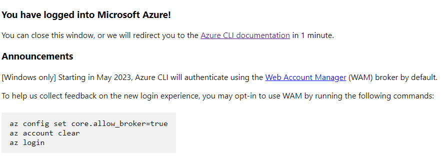
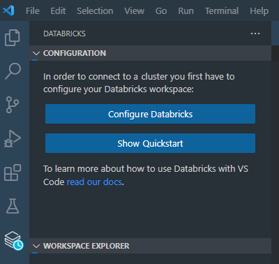
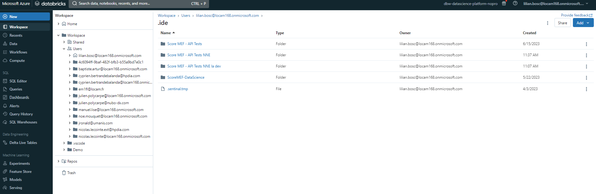
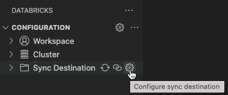
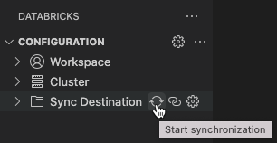

# How to set up VSCode to link it with Databricks

## To Do
- double check it

## Description
Notebooks are very common tools for data scientists to present data or even train and build models. Databricks is a cloud-based data engineering and analytics platform that provides us with a collaborative environment for creating and running notebooks.

To manipulate notebooks, it is easier to use VS Code and thanks to the Databricks and Databricks Power Tools extensions, it is possible to link Databricks Workspaces (even Repos but It seems less effective), Clusters and File Systems (DBFS) with VS Code. Here is how!

## Table of contents
[[_TOC_]]

## Requirements

| Tool              | Use                                                                                                              |
|-------------------|------------------------------------------------------------------------------------------------------------------|
| VS Code           | Local Code Interpreter                                                                                           |
| Git               | Git must be installed on your local computer                                                                     |
| Local Repository        | You must have cloned the repository on which you want to work with Git Clone from DevOps Repos                        |
| Microsoft Account | Accesses to a microsoft account with the rights to access the Data Science environment and especially Databricks |


## Steps

### Step 1: Install Azure CLI and login

[Official Documentation](https://learn.microsoft.com/en-gb/cli/azure/authenticate-azure-cli)

Azure CLI (Command-Line Interface) is a cross-platform command-line tool provided by Microsoft that enables users to manage and interact with Azure resources and services from their local machine through a command-line interface.
Install Azure CLI at this link: [Azure CLI Installer](https://learn.microsoft.com/fr-fr/cli/azure/install-azure-cli).

Run the following command and 
```bash
az login
```
It will open your browser on the login page of microsoft. Login with your Microsoft Account.
If this step if correctly executed, You should be left with something like this:

<div align="center">
	
</div>

This is one of the methods provided by Azure CLI to authentificate. You will find other methods in the Official Documentation.

### Step 2: Install Databricks Extension on VS Code

[Official Documentation](https://docs.databricks.com/dev-tools/vscode-ext.html)

Open Visual Studio Code, search "Databricks" in the Extensions and install it. After the installation is complete, you may need to reload Visual Studio Code for the changes to take effect.

Then you will see the following buttons when you run the extension. Click on "Configure Databricks".

<div align="center">
	
</div>

Copy / Paste your Databricks project ID, it must be something like this : "https://adb-3866322782297231.11.azuredatabricks.net/?o=3866322782297231#"

Then You will be asked to select an Authentification method, select Azure CLI. It should connect you automatically to the microsoft account.

### Step 3: Sync your local repository with a Workspace in Databricks

[Official Documentation](https://docs.databricks.com/dev-tools/vscode-ext.html)

The Databricks extension works better with Workspaces, so We will link it to the workspaces of your Databricks account:

<div align="center">
	
</div>

To achieve that, simply click on the gear next to "Sync Destination", and either Create or Select an existing Workspace.

<div align="center">
	
</div>

To start synchronizing click on the Sync logo as follow:

<div align="center">
	
</div>

```Note: If your synchronization fails, It can mean that one of the files you are trying to load to your Workspace contains an error. Check that out first.```

### Step 4: Install Databricks Power Tools Extension on VS Code

This Extension is needed to link the databricks clusters (also called Kernel by Jupyter Notebooks) with your Jupyter Notebooks. After the installation is complete, you may need to reload Visual Studio Code for the changes to take effect.

Once this is done, You will be able to select a Kernel within the Databricks Clusters.

Note that with this extension, you are able to see and create secrets.


## Support
lilian.bosc@hpdia.com

manuel.lise@hpdia.com

noe.mouquet@hpdia.com

cyprien.bertrandebalanda@hpdia.com

## License
HPDIA

